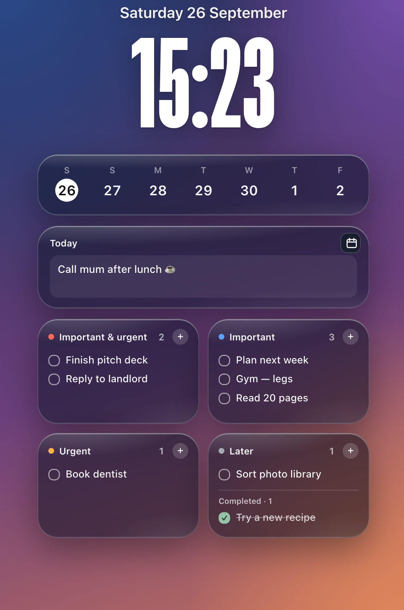

# King's Desk

A local Übersicht widget with a clock, a seven-day view of macOS Calendar, notes, and an Eisenhower task matrix. It uses `icalBuddy` to read Calendar events. Notes, tasks, layout, position, and appearance are saved on this Mac.



## Install

1. Install [Übersicht](https://tracesof.net/uebersicht/) and, for calendar events, icalBuddy:

   ```bash
   brew install ical-buddy
   ```

2. Clone this repo into the Übersicht widgets folder. Keep the folder name `kings-desk.widget`, because the fonts are loaded from that path:

   ```bash
   git clone https://github.com/Pankur888/kings-desk.widget.git ~/Library/Application\ Support/Übersicht/widgets/kings-desk.widget
   ```

3. The first time, macOS asks whether Übersicht may access your calendars. Allow it.

## Use

- Drag the clock or date to move the widget.
- Click the grid button above the widget to cycle through Classic, Vertical, and Compact layouts.
- Click the half-circle button to open Appearance. The style tiles (Standard, Tall, Thin, Rounded, Serif) set the clock in one click; the sliders fine-tune weight, width (SF Pro only; narrow is the tall lock-screen look), and size. You can also choose the widget font, widget size, color, glass shade, and surface effect.
- Click the open lock to hide layout and appearance controls and prevent dragging. The small closed lock remains at the top right; click it to unlock the controls again.
- Click the calendar icon beside Today, or a day in the week view, to open Calendar.app.
- Type in the note field; it saves as you type.
- Click `+` to add a task. Press Return to save or Escape to cancel. Click a task to complete it; completed tasks stay visible in their quadrant and can be clicked again to restore them. Hover over the completed list and click Clear to remove them.

Übersicht is configured to show King's Desk only on the macOS main display.

## Fonts

`fonts/` holds symlinks to Apple's own variable fonts in `/System/Library/Fonts` (SF Pro, SF Pro Rounded, SF Compact, New York, SF Mono). Loading them by file unlocks their weight and width settings. If you rename the widget folder, update `FONT_DIR` in `index.jsx`. Otherwise the clock falls back to the regular system font. Inter and Geist load from Google Fonts only when you pick them.
